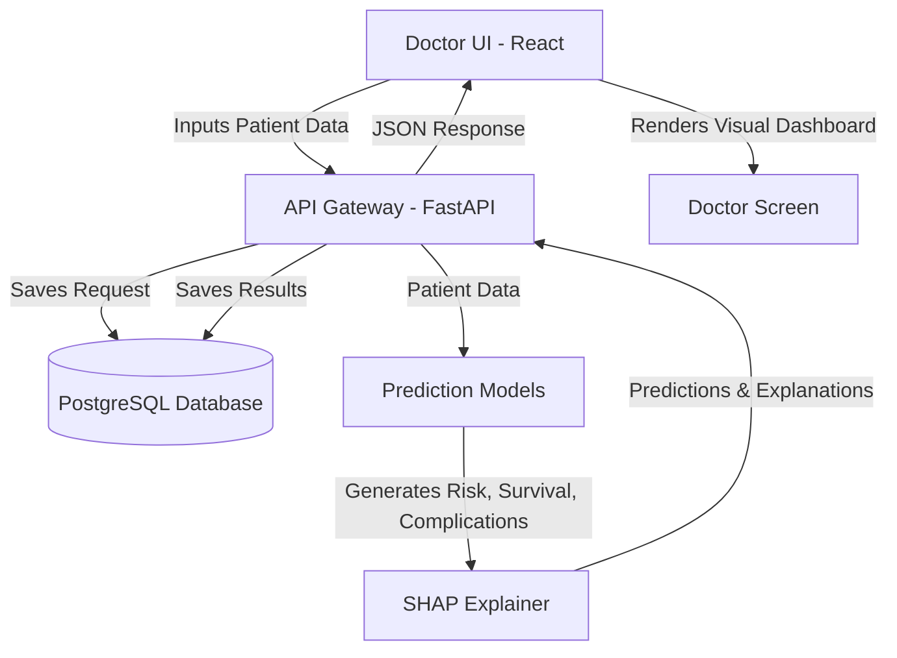

# Phase 1: Requirement Analysis & System Design

## 1. Problem Definition
The objective is to build an AI-powered system that assists anesthesiologists and medical professionals in evaluating patient risk prior to surgery. The system will predict:
- Anesthesia Risk Level: Low, Medium, High
- Survival Probability: Continuous value between 0.0 and 1.0
- Likely Complications: Multi-label classification (e.g., Hypotension, Arrhythmia, Respiratory Failure, PONV - Postoperative Nausea and Vomiting, Allergic Reaction)

## 2. Input Features (Patient Data)
- **Demographics:** Age, Gender, BMI
- **Vitals:** Blood Pressure (Systolic/Diastolic), Heart Rate, Oxygen Saturation (SpO2), Respiratory Rate
- **Medical History:** ASA Physical Status Classification (I-VI), Pre-existing conditions (Hypertension, Diabetes, Asthma, Cardiac Disease, Kidney Disease)
- **Lab Results (Optional/Extended):** Hemoglobin, Creatinine
- **Surgical Details:** Surgery Type (e.g., Cardiac, Orthopedic, General), Expected Duration, Emergency Status

## 3. Outputs
- **Risk Level:** Categorical (Low, Medium, High)
- **Survival Probability:** Float (0.0 to 1.0)
- **Complications:** Array of probabilities or binary flags for key complications.

## 4. System Architecture

### Frontend (User Interface)
- **Tech:** React, TailwindCSS, Recharts (for visualizations), Axios
- **Purpose:** Medical-grade dashboard for doctors to input patient data, visualize predictions, review SHAP explanations, and manage patient history.

### Backend (API Service)
- **Tech:** FastAPI (Python), SQLAlchemy (ORM), Pydantic
- **Purpose:** Handles REST API requests, connects to the database, securely processes authentication (JWT), and orchestrates model inference.

### ML Service (Embedded or separate via FastAPI)
- **Tech:** Scikit-learn, XGBoost, SHAP, Pandas
- **Purpose:** Preprocesses patient data, runs inference using the trained models, computes feature importance, and returns results.

### Database
- **Tech:** PostgreSQL
- **Purpose:** Stores patient records, prediction history, user (doctor/admin) accounts, and audit/access logs.

## 5. Data Flow Diagram

## 6. Tech Stack Justification
- **Frontend (React):** Component-based, highly responsive, and supported by a massive ecosystem for charting and modern UI (Crucial for Phase 17).
- **Backend (FastAPI):** Extremely fast, native async support, and native Python. It allows building the API and deploying the ML models seamlessly in the same ecosystem.
- **Database (PostgreSQL):** Robust, ACID-compliant relational DB, essential for the structured nature of electronic health records (EHR) and patient logs.
- **ML Stack (Scikit-learn, XGBoost, SHAP):** XGBoost is SOTA for tabular clinical data. SHAP provides the necessary explainability for medical trust.

## User Review Required
> [!IMPORTANT]
> Please review the proposed Requirement Analysis and System Design (Phase 1). Let me know if you approve this architecture or would like to add specific input features, complication categories, or technical constraints before we move on to **Phase 2: Project Setup & Folder Structure**.
 git commit -m "additions"   
